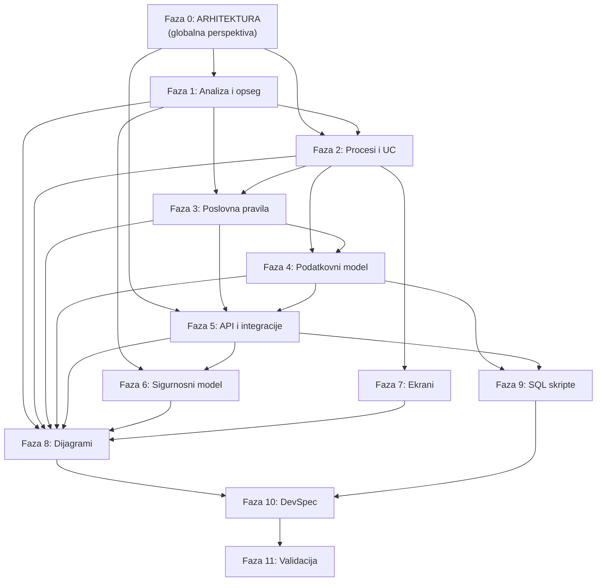

# Plan izrade developerske specifikacije — Modul C: eFTI Nadzor i validacija

**Verzija:** 1.1  
**Datum:** 4. travnja 2026.  
**Platforma:** .NET 8 / ASP.NET Core / MS SQL Server 2022 / Keycloak 24.x / Redis 7.x  
**Domena:** eFTI validacijski servis — provjera DG podataka protiv nacionalnih registara eADR  
**KB izvor:** `KNOWLEDGE_BASE_MODULE_C/` (48 artefakata)  
**Referentni model:** Modul B (`Modul_B_Draft_Dev_Spec_03042026/` — 11 foldera, 16 artefakata)

---

## Sadržaj

- [0. Ciljana struktura isporuke](#0-ciljana-struktura-isporuke)
- [Faza 0: Arhitekturno pozicioniranje i globalna perspektiva](#faza-0-arhitekturno-pozicioniranje-i-globalna-perspektiva)
- [Faza 1: Analiza i konsolidacija opsega](#faza-1-analiza-i-konsolidacija-opsega)
- [Faza 2: Poslovni procesi i Use Case model](#faza-2-poslovni-procesi-i-use-case-model)
- [Faza 3: Poslovna i validacijska pravila](#faza-3-poslovna-i-validacijska-pravila)
- [Faza 4: Podatkovni model](#faza-4-podatkovni-model)
- [Faza 5: API i integracije](#faza-5-api-i-integracije)
- [Faza 6: Sigurnosni model](#faza-6-sigurnosni-model)
- [Faza 7: Ekrani i nadzorna sučelja](#faza-7-ekrani-i-nadzorna-sučelja)
- [Faza 8: Dijagrami](#faza-8-dijagrami)
- [Faza 9: SQL skripte](#faza-9-sql-skripte)
- [Faza 10: Glavna developerska specifikacija](#faza-10-glavna-developerska-specifikacija)
- [Faza 11: Validacija i verifikacija](#faza-11-validacija-i-verifikacija)
- [Matrica agenta po tasku](#matrica-agenta-po-tasku)
- [Pravila rada](#pravila-rada)

---

## 0. Ciljana struktura isporuke

Po uzoru na Modul B, izlazna struktura u `modul_c_docs/`:

```
modul_c_docs/
├── PLAN_IZRADE_MODUL_C.md               ← OVAJ DOKUMENT
├── 00_Arhitektura/
│   └── ARHITEKTURA_MODUL_C.md             ← Globalna arhitektura i pozicioniranje u eFTI ekosustavu
├── 01_Glavna_specifikacija/
│   └── Modul_C_Nadzor_DevSpec.md         ← Master dokument (~8000–12000 linija)
├── 02_Poslovni_procesi/
│   ├── SUK_PROCESI_MODUL_C.md            ← SUK procesi PC01–PCxx
│   └── STATUSNI_DIJAGRAMI_MODUL_C.md     ← Statusni dijagrami (Mermaid)
├── 03_Use_case_model/
│   ├── USE_CASE_MODEL_MODUL_C.md         ← Opis use case-ova UC-C01–UC-Cxx
│   └── UC_DIJAGRAM_MODUL_C.puml          ← PlantUML dijagram
├── 04_Poslovna_pravila/
│   └── POSLOVNA_PRAVILA_MODUL_C.md       ← Pravila BR-C01–BR-Cxx s Given-When-Then AC
├── 05_Podatkovni_model/
│   ├── ER_MODEL_KONCEPTUALNI_MODUL_C.md  ← Konceptualni ER (domene, entiteti)
│   └── ER_MODEL_LOGICKI_MODUL_C.md       ← Logički ER (tipovi, FK, CHECK, indeksi)
├── 06_Ekrani_i_forme/
│   └── EKRANI_I_FORME_MODUL_C.md         ← Nadzorni dashboard, API management
├── 07_Integracije/
│   ├── INTEGRACIJE_MODUL_C.md            ← Sve integracije s protokolima
│   └── API_SPECIFIKACIJA_NSCP_eADR.md    ← OpenAPI-style REST specifikacija
├── 08_Sigurnosni_model/
│   └── SIGURNOSNI_MODEL_MODUL_C.md       ← RBAC, audit trail, NIS2, GDPR, OWASP
├── 09_Dijagrami/
│   └── DIJAGRAMI_MODUL_C.md              ← Mermaid dijagrami (arhitektura, sekvencijalni, ER)
├── 10_SQL_skripte/
│   ├── V1__create_eadr_schema_nadzor.sql  ← DDL: tablice, FK, indeksi, temporal
│   └── V2__seed_eadr_nadzor_codebooks.sql ← Seed: šifrarnici, ADR klase, UN brojevi
├── 11_Validacija/
│   ├── TABLICA_SLJEDIVOSTI_MODUL_C.md    ← Tvrdnja → izvor mapiranje
│   ├── VALIDACIJA_IZVORA_MODUL_C.md      ← Normativni izvori validirani
│   └── VALIDATION_REPORT_MODUL_C.md      ← V&V izvještaj sa nalazima
└── README.md                             ← Pregled isporuke (po uzoru na Modul B)
```

---

## Faza 0: Arhitekturno pozicioniranje i globalna perspektiva

**Cilj:** Jasno definirati kako Modul C funkcionira u kontekstu cjelokupnog eFTI ekosustava — od eFTI platforme do krajnjeg službenika. Ovaj dokument je **temeljni preduvjet** za sve ostale faze jer uspostavlja globalni komunikacijski model, razgraničenje odgovornosti i arhitekturne odluke. Bez njega, ostali artefakti nemaju referentni okvir.

---

### Task 0.1 — Arhitektura Modula C u eFTI ekosustavu

**Agent:** Integration  
**Ulaz (KB):**
- `05_ARCHITECTURE_CONTEXT/AAP_vs_eADR_Distinction.md` (artefakt #39) — razgraničenje AAP vs eADR, komunikacija, slojeviti prikaz
- `05_ARCHITECTURE_CONTEXT/EU_Reference_Architecture.md` (artefakt #48) — EU referentna arhitektura, IKT komponente
- `05_ARCHITECTURE_CONTEXT/Module_C_Scope_From_Sources.md` (artefakt #29) — 6 domena, cross-modul ovisnosti
- `05_ARCHITECTURE_CONTEXT/Module_A_Summary.md` (artefakt #27) — Modul A shema i tablice
- `05_ARCHITECTURE_CONTEXT/Module_B_Summary.md` (artefakt #28) — Modul B shema i tablice
- `01_EU_REGULATORY_FRAMEWORK/eFTI_Implementing_Reg_2024_1942.md` — čl. 2–9, IKT komponente, komunikacijski protokoli
- `01_EU_REGULATORY_FRAMEWORK/Germany_BAG_Implementation.md` (artefakt #44) — DE arhitektura
- `01_EU_REGULATORY_FRAMEWORK/Finland_Traficom_Implementation.md` (artefakt #46) — FI arhitektura

**Opis:**

Ovaj task producira **jedan sveobuhvatni arhitekturni dokument** koji odgovara na pitanje: **"Kako Modul C radi i gdje se nalazi u cijelom sustavu?"**

**Dokument MORA sadržavati sljedećih 10 sekcija:**

**Sekcija A — Globalni eFTI ekosustav (bird's-eye view):**
1. Prikaži cijeli lanac od vrha do dna:
   - Gospodarski subjekt (pošiljatelj/prijevoznik) → eFTI platforma (certificirani 3rd party sustav)
   - eFTI platforma → eFTI Gate (posrednik, čl. 6 Prov. uredbe) — AS4/eDelivery, SMP/SML
   - eFTI Gate → AAP/NSCP (pristupna točka nadležnog tijela, čl. 4 Prov. uredbe)
   - AAP/NSCP → eADR (nacionalni validacijski servis) — REST/JSON
   - Službenik nadležnog tijela → AAP/NSCP portal (korisnička aplikacija, čl. 7)
2. Jasno definiraj svaku komponentu: tko ju gradi, tko ju koristi, koji je pravni temelj.
3. Mermaid dijagram: **cjelokupni eFTI ekosustav** s jasno označenim protokolima, smjerovima i vlasništvima.

**Sekcija B — Pozicija eADR-a u nacionalnom kontekstu:**
1. eADR NIJE AAP, NIJE eFTI Gate, NIJE eFTI platforma — obrazloži svako "NIJE" s pravnim temeljem.
2. eADR JE nacionalni validacijski/enrichment servis za DG podatke — čist API, nema vlastiti portal.
3. eADR je satelitski sustav koji NSCP poziva kad eFTI dataset sadrži opasne tvari (eFTI1451 indikator).
4. Karta pozicioniranja: gdje u lancu se eADR uključuje, koji je trigger, tko ga aktivira.
5. Mermaid dijagram: **eADR pozicija u HR kontekstu** (NSCP, eADR, MUP, MMPI, AKD, CVH).

**Sekcija C — Komunikacijski model NSCP ↔ eADR:**
1. Protokol: REST/JSON (nacionalna odluka, čl. 9 Prov. uredbe dozvoljava nacionalni protokol za unutar-DČ komunikaciju).
2. Smjer: **NSCP inicira** → eADR odgovara (request-response, sync).
3. Autentikacija: Keycloak client credentials JWT (service-to-service).
4. Timeout: <10 sekundi (jer eFTI Gate ima 60s ukupni timeout, čl. 6).
5. Popis API poziva — koji endpointi postoje, koji se kad pozivaju (E-01 do E-07 iz Taska 5.1 — ovdje navesti konceptualno, ne u detalju).
6. Idempotentnost i retry strategija (X-Request-ID, exponential backoff).
7. Mermaid sekvencijalni dijagram: **kompletni tok NSCP → eADR → odgovor** uključujući error scenarije.

**Sekcija D — Interna arhitektura eADR sustava (Moduli A + B + C):**
1. Tri modula, tri MS SQL sheme: `eadr_osposobljavanje` (A), `eadr_dopustenja` (B), `eadr_nadzor` (C).
2. Modul C **čita** iz Modula A (4 tablice: `ADRPotvrda`, `ADRPotvrdaOvlast`, `Vozac`, `SigurnosniSavjetnik`) i Modula B (9 tablica: `AktivnoDopustenje`, `VrstaDopustenja`, `TransferDokument`, `OkcNajava`, `OkcStavka`, `CvhVozilo`, `PoslovniSubjekt`, `Stavka`, `SubstancaOdnosnoSmjesa`).
3. Modul C **NE piše** u A i B — isključivo read-only cross-schema pristup putem SQL VIEW-ova.
4. Modul C **piše** u vlastitu shemu (`eadr_nadzor`) — zahtjevi, rezultati, audit, konfiguracija.
5. Mermaid dijagram: **interna eADR arhitektura** s 3 modula, shemama, smjerom podataka.

**Sekcija E — Tok validacije — korak po korak (end-to-end):**
1. Detaljan opis CIJELOG toka od trenutka kad eFTI platforma pošalje dataset do trenutka kad službenik vidi rezultat:
   - Korak 1: Gospodarski subjekt učitava DG podatke na eFTI platformu
   - Korak 2: eFTI platforma registrira UIL u Registru identifikatora (čl. 11)
   - Korak 3: Službenik na terenu zaustavi vozilo, zatraži provjeru putem NSCP mobilne aplikacije
   - Korak 4: NSCP prima zahtjev, autentificira službenika (NIAS/Keycloak), autorizira (Registar ovlaštenja, čl. 5)
   - Korak 5: NSCP šalje zahtjev eFTI Gateu s UIL-om ili identifikatorom
   - Korak 6: eFTI Gate pronalazi platformu putem SMP/SML, šalje zahtjev putem AS4/eDelivery
   - Korak 7: eFTI platforma vraća eFTI dataset
   - Korak 8: NSCP prima dataset, detektira DG indikator (eFTI1451)
   - Korak 9: NSCP ekstrahira DG podskup i poziva eADR API (`POST /api/v1/validate/dg-dataset`)
   - Korak 10: eADR Modul C parsira DG podskup, izvlači UN brojeve, klase, vozača, subjekt
   - Korak 11: Modul C poziva Modul A (cross-schema SELECT na ADRPotvrda)
   - Korak 12: Modul C poziva Modul B (cross-schema SELECT na AktivnoDopustenje, TransferDokument, OkcNajava)
   - Korak 13: Modul C poziva CVH adapter za provjeru vozila
   - Korak 14: Modul C konsolidira sve provjere → PASS/FAIL/PARTIAL/UNKNOWN
   - Korak 15: eADR vraća JSON odgovor NSCP-u
   - Korak 16: NSCP konsolidira eFTI dataset + eADR rezultat i prikazuje službeniku
2. Za svaki korak navesti: tko inicira, tko odgovara, koji protokol, koji podaci teku, koje greške mogu nastati.
3. Mermaid sekvencijalni dijagram: **end-to-end tok** svih 16 koraka.

**Sekcija F — Tok izravnog upita (bez eFTI Gatea):**
1. Scenarij: službenik koristi NSCP za izravnu provjeru vozača/vozila/dopuštenja (bez eFTI razmjene).
2. NSCP poziva eADR direktne endpointe: `GET /api/v1/validate/driver/{oib}`, `GET /api/v1/validate/vehicle/{reg}`.
3. Kraći tok: NSCP → eADR → Modul A/B → odgovor.
4. Razlika: nema eFTI dataseta, nema eFTI Gatea, čisti nacionalni upit.
5. Mermaid sekvencijalni dijagram: **izravni upit**.

**Sekcija G — Granice odgovornosti (Responsibility Boundary Map):**
1. Tablica: koji sustav je odgovoran za što (NSCP vs eADR vs eFTI Gate vs eFTI platforma).
2. Tablica: koji modul eADR-a je odgovoran za što (A vs B vs C).
3. Eksplicitno navesti: što Modul C NE radi (ne autentificira korisnike, ne komunicira s eFTI Gateom, ne prikazuje UI, ne pohranjuje eFTI dataset, ne upravlja UIL-ovima).
4. Jasna granica API-ja: eADR prima obrađene nacionalne podatke, ne sirove eFTI XML.

**Sekcija H — Zajedničke komponente eADR-a (shared infrastructure):**
1. Keycloak 24.x: zajednički za A, B, C — realm konfiguracija, klijenti, uloge.
2. Redis 7.x: zajednički cache/session — što Modul C cachira (ADR šifrarnike, validacijska pravila, session).
3. MS SQL Server 2022: 3 sheme u jednoj instanci — `eadr_osposobljavanje`, `eadr_dopustenja`, `eadr_nadzor`.
4. Splunk: zajednički structured logging.
5. .NET 8 deployment: jedan deployment ili odvojeni mikroservisi? Definiraj arhitekturnu odluku s obrazloženjem.

**Sekcija I — Arhitekturne odluke i obrazloženja (ADR — Architecture Decision Records):**
1. ADR-001: REST/JSON za NSCP↔eADR (ne AS4/eDelivery) — obrazloženje, alternative, odluka.
2. ADR-002: Sync request-response (ne async message queue) — obrazloženje, alternative, odluka.
3. ADR-003: Cross-schema SQL VIEW umjesto API poziva A↔C i B↔C — obrazloženje, alternative, odluka.
4. ADR-004: Nacionalni JSON format umjesto eFTI CDM XML — obrazloženje, alternative, odluka.
5. ADR-005: Monolitna .NET 8 aplikacija s modulima (ne mikroservisi) — obrazloženje, alternative, odluka (ili obrnuto — zavisi od KB izvora).
6. Za svaku odluku: kontekst, razmotrene opcije, odluka, posljedice.

**Sekcija J — Dijagramska mapa:**
1. Sumarni pregled svih Mermaid dijagrama iz ovog dokumenta — indeks s cross-referencama.
2. Minimalno 6 dijagrama:
   - D-A01: eFTI ekosustav — globalni pregled (graph TD)
   - D-A02: eADR pozicija u HR kontekstu (graph TD)
   - D-A03: NSCP ↔ eADR komunikacija (sequenceDiagram)
   - D-A04: Interna eADR arhitektura — 3 modula (graph LR)
   - D-A05: End-to-end validacijski tok (sequenceDiagram)
   - D-A06: Izravni upit — skraćeni tok (sequenceDiagram)

**Izlaz:** `modul_c_docs/00_Arhitektura/ARHITEKTURA_MODUL_C.md`  
**Preduvjeti:** Nema — ovo je PRVI task koji se izvršava  
**Procjena složenosti:** Visoka

---

## Faza 1: Analiza i konsolidacija opsega

**Cilj:** Definirati konačni opseg Modula C na temelju svih KB artefakata. Razriješiti otvorena pitanja gdje je moguće; dokumentirati pretpostavke za neriješena pitanja. Analizirati referentne implementacije (DE, FI) za primjenjive obrasce.

---

### Task 1.1 — Konsolidacija opsega i razgraničenje domena

**Agent:** Analyst  
**Ulaz (KB):**
- `05_ARCHITECTURE_CONTEXT/Module_C_Scope_From_Sources.md` (artefakt #29) — 6 domena C1–C6
- `05_ARCHITECTURE_CONTEXT/AAP_vs_eADR_Distinction.md` (artefakt #39) — razgraničenje AAP vs eADR
- `07_BLOCKERS_AND_UNKNOWNS/Open_Questions.md` (artefakt #40) — OC-01 do OC-08, blokeri BL-C-01 do BL-C-08
- `04_POZIV_NABAVA/Poziv_za_dostavu_ponuda_23_OT_OGRPN.md` (artefakt #37) — zahtjevi naručitelja

**Opis:**
1. Pročitaj KB artefakte #29 (scope), #39 (AAP vs eADR), #40 (open questions), #37 (poziv za nabavu).
2. Za svaku od 6 domena (C1–C6) donesi zaključak: **IN SCOPE / OUT OF SCOPE / DRAFT-CONDITIONAL**.
3. Za domene C5 (real-time tracking) i C6 (otpad):
   - Analiziraj NPOO tekst (artefakt #4, str. 296–298) — NPOO eksplicitno navodi praćenje u realnom vremenu.
   - Analiziraj Poziv za nabavu (#37) — je li tracking naveden kao zahtjev?
   - Napravi preporuku: ako nema dovoljno informacija za specifikaciju, označi kao „DRAFT — čeka odluku MMPI-ja" i definiraj minimalni placeholder koji će se moći proširiti.
4. Za OC-04 (sync REST vs async) — analiziraj artefakte #48 (EU referentna arhitektura) i #42 (eFTI4EU), preporuči sync REST/JSON s argumentacijom (timeout ≤60s, validacija je near-real-time).
5. Za OC-08 (format odgovora) — preporuči nacionalni JSON format s mapiranjem na eFTI CDM (argumentacija: eADR je interni servis, ne izlazi izravno na eFTI Gate).
6. Dokumentiraj sve pretpostavke s oznakom `PRETPOSTAVKA-Cxx`.

**Izlaz:** `modul_c_docs/01_Glavna_specifikacija/SCOPE_MODUL_C.md`  
**Preduvjeti:** Task 0.1  
**Procjena složenosti:** Srednja

---

### Task 1.2 — Analiza referentnih implementacija za primjenjive obrasce

**Agent:** Analyst  
**Ulaz (KB):**
- `01_EU_REGULATORY_FRAMEWORK/Germany_BAG_Implementation.md` (artefakt #44) — DE implementacija
- `01_EU_REGULATORY_FRAMEWORK/Finland_Traficom_Implementation.md` (artefakt #46) — FI implementacija
- `01_EU_REGULATORY_FRAMEWORK/eFTI4EU_Project_Overview.md` (artefakt #42) — EU piloti
- `05_ARCHITECTURE_CONTEXT/EU_Reference_Architecture.md` (artefakt #48) — referentna arhitektura

**Opis:**
1. Pročitaj artefakte #44 (Njemačka), #46 (Finska), #42 (eFTI4EU), #48 (EU ref. arhitektura).
2. Za svaki od 3 izvora (DE, FI, eFTI4EU) ekstrahiraj:
   - Kako je organizirana komunikacija između nacionalnog modula i AAP/Gate-a
   - Koji protokoli i formati se koriste
   - Kako je riješena DG validacija (ako je primjenjivo)
   - Koji su piloti provedeni i kakvi su rezultati
3. Napravi matricu usporedbe: DE vs FI vs HR (planirano) — 10 dimenzija (pravni okvir, institucionalna struktura, tehnička arhitektura, DG pristup, eFTI spremnost...).
4. Identificiraj **prenosive lekcije** za eADR Modul C — konkretne tehničke i procesne odluke koje HR može usvojiti.
5. Posebno analiziraj:
   - Njemački GBK Trusted Partner model (elektronički DG dokument po ADR 5.4.0.2) — primjenjivost za eADR
   - Finski Fintraffic eFTI Gate PoC (open source) — mogućnost korištenja komponenti
   - AlbrechtConsult eDGTI/eFTI harmonizacijski projekt — zaključci za eADR

**Izlaz:** `modul_c_docs/01_Glavna_specifikacija/REFERENTNE_IMPLEMENTACIJE_ANALIZA.md`  
**Preduvjeti:** Task 0.1  
**Procjena složenosti:** Srednja

---

### Task 1.3 — Normativni pravni okvir Modula C

**Agent:** Analyst  
**Ulaz (KB):**
- `01_EU_REGULATORY_FRAMEWORK/` — svi artefakti (eFTI uredba, direktive, ADR, CMR, e-CMR, Delegirana uredba 2024/2024)
- `03_HR_LEGAL_FRAMEWORK/` — svi artefakti (Zakon_Prijevoz_Opasnih_Tvari, AKD analize, Pravilnici, eFTI provedba)
- `04_POZIV_NABAVA/Poziv_za_dostavu_ponuda_23_OT_OGRPN.md` (artefakt #37) — popis propisa iz nabave

**Opis:**
1. Pročitaj sve pravne artefakte iz `01_EU` i `03_HR` foldera.
2. Kompiliraj konsolidirani popis normativnih izvora Modula C — po uzoru na Modul B sekcija 2 (ali za Module C specifičnu regulativu):
   - **Međunarodni/EU akti**: Uredba 2020/1056 (eFTI), Prov. uredba 2024/1942, Del. uredba 2024/2024, Prov. uredba 2025/2243, Direktiva 2008/68/EZ, ADR 2025, CMR, e-CMR, Uredba 1013/2006 (otpad — ako u scopeu)
   - **HR zakoni**: ZoPOT (NN 79/07, 70/17), predloženi čl. 21.a, ZoPCP (NN 136/2024), eIDAS (NN 62/17), GDPR provedba (NN 42/18)
   - **HR pravilnici**: relevantni iz kataloga 22 podzakonska akta (artefakt #26)
   - **NIS2**: identificirani iz poziva za nabavu ali nerazrađeni — navesti kao placeholder
3. Za svaki izvor navedi: oznaku, NN/EUR-Lex broj, relevantne članke, status (na snazi / prestao / ne postoji).
4. Posebno istakni pravne praznine (BL-C-01: nema nacionalnog zakona, BL-C-02: e-CMR neratificiran, BL-C-03: nacionalne mjere neizvršene).

**Izlaz:** `modul_c_docs/01_Glavna_specifikacija/NORMATIVNI_OKVIR_MODUL_C.md`  
**Preduvjeti:** Task 1.1  
**Procjena složenosti:** Srednja

---

### Task 1.4 — Identifikacija aktera, institucija i uloga

**Agent:** Analyst  
**Ulaz (KB):**
- `05_ARCHITECTURE_CONTEXT/Module_C_Scope_From_Sources.md` §8 — RBAC uloge za C
- `03_HR_LEGAL_FRAMEWORK/AKD_Mapiranje_propisa.md` (#35) — 12 nadležnih tijela s ovlastima
- `03_HR_LEGAL_FRAMEWORK/AKD_Analiza_pravnog_okvira_ADR.md` (#33) — sudionici prijevoza
- `05_ARCHITECTURE_CONTEXT/Module_B_Summary.md` (#28) — RBAC uloge Modula B
- `07_BLOCKERS_AND_UNKNOWNS/Open_Questions.md` — OC-02 (koja tijela koriste eADR?)

**Opis:**
1. Pročitaj KB artefakte #35 (12 nadležnih tijela), #33 (sudionici), #28 (B RBAC uloge), #29 §8 (C RBAC uloge).
2. Definiraj sve aktere Modula C:
   - **Službenik nadležnog tijela** — MUP, Carinska uprava, MMPI inspektorat, inspekcija zaštite okoliša
   - **NSCP sustav** (AAP) — sistemski akter koji poziva eADR API
   - **eADR sustav** — sistemski akter koji odgovara na zahtjeve
   - **Administrator** — AKD operater, konfiguracija šifrarnika
   - **Auditor** — read-only pristup audit logu
3. Za svakog aktera definiraj: instituciju, opis, ovlasti u Modulu C, RBAC ulogu, LoA razinu za autentikaciju.
4. Napravi matricu akter × domena C1–C6 (koji akter koristi koju domenu).
5. POSEBNO: Za OC-02 dokumentiraj pretpostavku — „pretpostavljamo da eADR provjere koriste: MUP (cestovna/granična policija), Carinska uprava (granični prijelazi), MMPI inspektorat. Čeka potvrdu MMPI-ja."

**Izlaz:** `modul_c_docs/01_Glavna_specifikacija/AKTERI_I_ULOGE_MODUL_C.md`  
**Preduvjeti:** Task 1.1  
**Procjena složenosti:** Niska

---

## Faza 2: Poslovni procesi i Use Case model

**Cilj:** Definirati SUK procese, use case-ove i statusne dijagrame po uzoru na Module B. Module C ima drugačiju prirodu (API/validacijski servis), pa procesi opisuju **tok validacije**, **tok inspekcijskog zahtjeva**, **tok administracije** i **tok nadzornoga dashboarda**.

---

### Task 2.1 — SUK procesi Modula C (PC01–PCxx)

**Agent:** Process Engineer  
**Ulaz (KB):**
- `05_ARCHITECTURE_CONTEXT/Module_C_Scope_From_Sources.md` §4 — 6 domena s opisima
- `05_ARCHITECTURE_CONTEXT/AAP_vs_eADR_Distinction.md` §5 — komunikacija AAP ↔ eADR
- `05_ARCHITECTURE_CONTEXT/EU_Reference_Architecture.md` (#48) — tok inspekcijskog zahtjeva
- Modul B referenca: `02_Poslovni_procesi/SUK_PROCESI_MODUL_B.md` — format i struktura 12 elemenata SUK

**Opis:**
1. Pročitaj KB artefakte #29 §4 (domene), #39 §5 (komunikacija), #48 (EU ref. arhitektura tok zahtjeva).
2. Pročitaj Modul B `SUK_PROCESI_MODUL_B.md` — razumij format (12 elemenata SUK: naziv, oznaka, vlasnik, ulazni događaj, izlazni događaj, akteri, koraci, poslovni kontekst, veza s UC, statusni prijelazi, alternativni tokovi, otvorena pitanja).
3. Definiraj SUK procese za Modul C. Predloženi procesi:

| Oznaka | Naziv | Kratki opis |
|--------|-------|-------------|
| PC01 | Primitak i parsiranje eFTI DG dataseta | NSCP šalje DG podskup; eADR parsira i validira format prema CDM |
| PC02 | Validacija ADR potvrde vozača | Provjera iz Modula A: OIB → ADRPotvrda → klase → valjanost |
| PC03 | Validacija dopuštenja za klasu 1 | Provjera iz Modula B: subjekt/vozilo → AktivnoDopustenje |
| PC04 | Validacija transfer dokumenta | Za prekogranični prijevoz: provjera TransferDokument iz Modula B |
| PC05 | Validacija OKC najave | Provjera iz Modula B: je li prijevoz najavljen u zakonskom roku |
| PC06 | Validacija vozila (ADR sukladnost) | Provjera CVH registra: ADR certifikat, tehnički pregled, rok |
| PC07 | Validacija poslovnog subjekta | Provjera identiteta i registracije prijevoznika/pošiljatelja |
| PC08 | Konsolidacija rezultata i odgovor NSCP-u | Agregacija svih provjera u jedinstven odgovor (PASS/FAIL/PARTIAL) |
| PC09 | Administracija šifrarnika i konfiguracije | Upravljanje ADR klasama, UN brojevima, pragovima, timeout-ima |
| PC10 | Audit i monitoring | Praćenje svih zahtjeva, odgovora, grešaka; revizijski trag |

4. Za svaki proces popuni svih 12 SUK elemenata identično formatu Modula B.
5. U koracima procesa navesti **konkretne tablice i polja** koja se čitaju (npr. „Dohvati iz eadr_osposobljavanje.ADRPotvrda WHERE oib = <ulazni_oib>").
6. Za C5 (real-time tracking) i C6 (otpad): napraviti placeholder SUK procese (PC11, PC12) ako su u draft scopeu.

**Izlaz:** `modul_c_docs/02_Poslovni_procesi/SUK_PROCESI_MODUL_C.md`  
**Preduvjeti:** Task 1.1, Task 1.4  
**Procjena složenosti:** Visoka

---

### Task 2.2 — Statusni dijagrami Modula C

**Agent:** Process Engineer  
**Ulaz (KB):**
- Izlaz Taska 2.1 (SUK procesi)
- Modul B referenca: `02_Poslovni_procesi/STATUSNI_DIJAGRAMI_MODUL_B.md`

**Opis:**
1. Pročitaj Modul B `STATUSNI_DIJAGRAMI_MODUL_B.md` — razumij format (Mermaid stateDiagram-v2).
2. Na temelju SUK procesa iz Taska 2.1, definiraj statusne dijagrame za ključne entitete Modula C:
   - **Zahtjev za validaciju** (ValidationRequest): RECEIVED → PARSING → VALIDATING → COMPLETED / ERROR
   - **Rezultat validacije** (ValidationResult): PENDING → PASS / FAIL / PARTIAL / UNKNOWN / TIMEOUT
   - **Pojedinačna provjera** (CheckResult): QUEUED → RUNNING → PASS / FAIL / SKIPPED / ERROR
   - **Šifrarnik** (ConfigEntry): ACTIVE / INACTIVE / DEPRECATED
3. Za svaki dijagram definirati:
   - Sve moguće statuse s opisom
   - Sve dozvoljene prijelaze (tranzicije)
   - Triggere prijelaza (koja akcija/događaj uzrokuje prijelaz)
   - Guard uvjete (uvjeti pod kojima je prijelaz dozvoljen)
4. Sve dijagrame izraditi u Mermaid `stateDiagram-v2` formatu.

**Izlaz:** `modul_c_docs/02_Poslovni_procesi/STATUSNI_DIJAGRAMI_MODUL_C.md`  
**Preduvjeti:** Task 2.1  
**Procjena složenosti:** Srednja

---

### Task 2.3 — Use Case model (UC-C01–UC-Cxx)

**Agent:** Analyst  
**Ulaz (KB):**
- Izlaz Taska 2.1 (SUK procesi)
- Izlaz Taska 1.4 (akteri i uloge)
- `05_ARCHITECTURE_CONTEXT/Module_C_Scope_From_Sources.md` §4 — domene i logika provjere
- Modul B referenca: `03_Use_case_model/USE_CASE_MODEL_MODUL_B.md`

**Opis:**
1. Pročitaj Modul B `USE_CASE_MODEL_MODUL_B.md` — razumij format (ID, naziv, akteri, preduvjeti, osnovni tok, alternativni tokovi, poslovni kontekst, veza s BR, veza sa SUK).
2. Na temelju SUK procesa (Task 2.1) i aktera (Task 1.4), definiraj use case-ove. Predloženi UC-ovi:

| ID | Naziv | Akter(i) |
|----|-------|----------|
| UC-C01 | Primanje zahtjeva za DG validaciju od NSCP-a | NSCP sustav |
| UC-C02 | Parsiranje i validacija eFTI DG dataseta | eADR sustav |
| UC-C03 | Provjera ADR potvrde vozača | eADR sustav |
| UC-C04 | Provjera dopuštenja za klasu 1 | eADR sustav |
| UC-C05 | Provjera transfer dokumenta (prekogranični) | eADR sustav |
| UC-C06 | Provjera OKC najave | eADR sustav |
| UC-C07 | Provjera ADR sukladnosti vozila | eADR sustav |
| UC-C08 | Provjera poslovnog subjekta | eADR sustav |
| UC-C09 | Konsolidacija i vraćanje rezultata NSCP-u | eADR sustav |
| UC-C10 | Pregled validacijskih rezultata (dashboard) | Službenik nadležnog tijela |
| UC-C11 | Pregled audit loga validacija | Auditor |
| UC-C12 | Upravljanje ADR šifrarnicima | Administrator |
| UC-C13 | Upravljanje validacijskim pravilima | Administrator |
| UC-C14 | Upravljanje konfiguracijom servisa | Administrator |
| UC-C15 | Dohvat ADR potvrde po OIB-u (direktan upit) | NSCP sustav |
| UC-C16 | Dohvat aktivnog dopuštenja (direktan upit) | NSCP sustav |
| UC-C17 | Health check i statistike servisa | NSCP sustav / Administrator |

3. Za svaki UC popuniti sve elemente identično Modulu B:
   - ID, naziv, akteri, preduvjeti, osnovni tok (koraci), alternativni tokovi, izuzeci/greške,
     posljedice, poslovni kontekst, reference na BR (poslovna pravila), reference na SUK proces
4. Posebna pažnja na UC-C01–UC-C09 jer čine srž validacijskog servisa — tok mora precizno opisati
   redoslijed poziva prema Modulima A i B, timeout ponašanje i konsolidaciju rezultata.

**Izlaz:** `modul_c_docs/03_Use_case_model/USE_CASE_MODEL_MODUL_C.md`  
**Preduvjeti:** Task 2.1, Task 1.4  
**Procjena složenosti:** Visoka

---

### Task 2.4 — PlantUML Use Case dijagram

**Agent:** Process Engineer  
**Ulaz:**
- Izlaz Taska 2.3 (Use Case model)
- Modul B referenca: `03_Use_case_model/UC_DIJAGRAM_MODUL_B.puml`

**Opis:**
1. Pročitaj Modul B `UC_DIJAGRAM_MODUL_B.puml` — razumij PlantUML syntax.
2. Na temelju UC-ova iz Taska 2.3, kreiraj PlantUML dijagram:
   - Definiraj aktere (NSCP sustav, eADR sustav, Službenik, Administrator, Auditor)
   - Grupiraj UC-ove po domenama (C1: validacija, C4: nadzor/dashboard, administracija)
   - Prikaži veze (include, extend) između UC-ova
   - Koristi `@startuml` / `@enduml` i `rectangle` za pakete

**Izlaz:** `modul_c_docs/03_Use_case_model/UC_DIJAGRAM_MODUL_C.puml`  
**Preduvjeti:** Task 2.3  
**Procjena složenosti:** Niska

---

## Faza 3: Poslovna i validacijska pravila

**Cilj:** Definirati sva poslovna pravila Modula C s posebnim naglaskom na validacijska pravila eFTI DG dataseta. Module C je primarno validacijski servis, pa su pravila srž specifikacije.

---

### Task 3.1 — Poslovna pravila Modula C (BR-C01–BR-Cxx)

**Agent:** QA  
**Ulaz (KB):**
- `05_ARCHITECTURE_CONTEXT/Module_C_Scope_From_Sources.md` §4, §5, §6 — logika provjere C→A, C→B
- `01_EU_REGULATORY_FRAMEWORK/DELEGIRANA UREDBA KOMISIJE (EU) 2024-2024/` — eFTI CDM, DG pod-skup, validacijska pravila
- `03_HR_LEGAL_FRAMEWORK/Zakon_Prijevoz_Opasnih_Tvari.md` (#21) — obveze dokumentacije
- `03_HR_LEGAL_FRAMEWORK/HR_Pravilnici_ADR.md` (#26) — pravilnici o inspekciji
- `03_HR_LEGAL_FRAMEWORK/AKD_Dopuna_1_faze.md` (#34) — čl. 21.a (8 ovlasti)
- Modul B referenca: `04_Poslovna_pravila/POSLOVNA_PRAVILA_MODUL_B.md`

**Opis:**
1. Pročitaj Modul B `POSLOVNA_PRAVILA_MODUL_B.md` — razumij format (ID, naziv, kategorija, opis pravila, Given-When-Then prihvatni kriterij, izvor/referenca).
2. Pročitaj KB artefakte #29 §4–§6 (logika provjera), Delegiranu uredbu 2024/2024 (validacijska pravila za DG dataset), #21, #26, #34.
3. Definiraj poslovna pravila za Modul C. Predložene kategorije:

   **A) Pravila parsiranja eFTI dataseta (BR-C01–BR-C05):**
   - Format validacija (JSON/XML schema)
   - Obavezna polja DG dataseta prema Del. uredbi 2024/2024
   - UN broj format i raspon
   - ADR klasa/podklasa validacija
   - Oznake opasnosti (hazard labels) validacija

   **B) Pravila provjere vozača (BR-C06–BR-C10):**
   - ADR potvrda mora postojati i biti aktivna
   - ADR potvrda mora pokrivati klasu opasne tvari
   - Potvrda ne smije biti istekla
   - OIB vozača mora odgovarati identifikatoru iz eFTI dataseta
   - Suspendirana/oduzeta potvrda = FAIL

   **C) Pravila provjere dopuštenja (BR-C11–BR-C16):**
   - Za klasu 1 MORA postojati aktivno dopuštenje
   - Dopuštenje mora pokrivati vrstu prijevoza (domaći/prekogranični)
   - Transfer dokument obavezan za prekogranični prijevoz
   - OKC najava obavezna za klasu 1 — provjeriti zakonski rok
   - Cross-validacija stavki: stavke u dopuštenju moraju odgovarati eFTI datasetu
   - Količine ne smiju prelaziti odobrene limite

   **D) Pravila provjere vozila (BR-C17–BR-C20):**
   - Vozilo mora imati valjan ADR certifikat
   - Tehnički pregled mora biti aktualan
   - Registarska oznaka iz eFTI dataseta mora odgovarati CVH zapisu
   - VIN cross-provjera

   **E) Pravila provjere subjekta (BR-C21–BR-C23):**
   - OIB/VAT ID validacija (MOD11 za HR OIB)
   - Prijevoznik mora biti registriran u sustavu
   - Mapiranje uloga pošiljač/prijevoznik/primatelj

   **F) Pravila konsolidacije (BR-C24–BR-C28):**
   - Ukupni rezultat = PASS samo ako sve provjere PASS
   - FAIL ako barem jedna provjera FAIL
   - PARTIAL ako neke provjere PASS, neke SKIPPED/UNKNOWN
   - Timeout pravilo: ako odgovor ne stigne u X sekundi → TIMEOUT
   - Svaki rezultat mora sadržavati timestamp, trace ID, listu provjera

   **G) Pravila audita i sigurnosti (BR-C29–BR-C32+):**
   - Svaki zahtjev se logira u audit trail
   - Osobni podaci (OIB) se maskraju u logu
   - Svaki zahtjev mora imati valid JWT token
   - Rate limiting: max N zahtjeva/min po klijentu

4. Za svako pravilo popuniti identičan format kao Modul B:
   - ID, naziv, kategorija, opis, Given-When-Then AC, normativni izvor, utjecaj

**Izlaz:** `modul_c_docs/04_Poslovna_pravila/POSLOVNA_PRAVILA_MODUL_C.md`  
**Preduvjeti:** Task 1.1, Task 1.3, Task 2.1  
**Procjena složenosti:** Visoka

---

## Faza 4: Podatkovni model

**Cilj:** Definirati podatkovni model specifičan za Modul C — shemu `eadr_nadzor` s tablicama za zapisivanje validacijskih zahtjeva, rezultata, konfiguracije i audit loga. Module C NE duplicira tablice iz A i B — čita ih cross-schema.

---

### Task 4.1 — Konceptualni ER model

**Agent:** Data Model  
**Ulaz (KB):**
- Izlaz Taska 2.1 (SUK procesi — entiteti i tokovi)
- Izlaz Taska 3.1 (poslovna pravila — implikacije na model)
- `05_ARCHITECTURE_CONTEXT/Module_C_Scope_From_Sources.md` §5, §6 — ovisnosti C→A, C→B
- `01_EU_REGULATORY_FRAMEWORK/DELEGIRANA UREDBA KOMISIJE (EU) 2024-2024/` — eFTI CDM DG podskup
- Modul B referenca: `05_Podatkovni_model/ER_MODEL_KONCEPTUALNI_MODUL_B.md`

**Opis:**
1. Pročitaj Modul B `ER_MODEL_KONCEPTUALNI_MODUL_B.md` — razumij format (domene, entiteti, atributi, kardinaliteti).
2. Na temelju SUK procesa i poslovnih pravila, identificiraj entitete specifične za Modul C:

   **Predložene domene i entiteti:**

   **D1 — Validacijski zahtjevi:**
   - `ValidacijskiZahtjev` — ulazni zahtjev od NSCP-a (request_id, timestamp, source_system, efti_uil, raw_payload, status)
   - `DgDataset` — parsirani DG podskup iz eFTI dataseta (un_broj, klasa, podklasa, kolicina, opis_tvari, hazard_labels)

   **D2 — Rezultati validacije:**
   - `ValidacijskiRezultat` — konsolidirani odgovor (result_id, zahtjev_id, ukupni_status, timestamp_start, timestamp_end, duration_ms)
   - `PojedinacnaProvjera` — rezultat jedne provjere (check_id, tip_provjere, status, detalji, izvorni_modul, referentni_entitet_id)

   **D3 — Konfiguracija i šifrarnici:**
   - `AdrKlasa` — šifrarnik ADR klasa/podklasa s opisima
   - `UnBroj` — šifrarnik UN brojeva opasnih tvari
   - `OznakaOpasnosti` — hazard labels
   - `ValidacijskoPravilo` — konfigurirajuća validacijska pravila (operator, threshold, aktivan_od/do)
   - `SustavskiParametar` — konfiguracija servisa (timeout, rate limit, cache TTL)

   **D4 — Audit i monitoring:**
   - `AuditLog` — revizijski trag (entity_type, entity_id, action, actor_id, timestamp, details)
   - `ApiPristup` — zapis API poziva (ip_adresa, endpoint, http_metoda, status_kod, odgovor_ms)

   **D5 — eFTI mapiranje:**
   - `EftiCdmMapiranje` — mapiranje eFTI CDM element → eADR polje (efti_element_id, efti_name, eadr_table, eadr_column)

3. Za svaki entitet navesti: naziv, opis, domenu, kardinalitete, ključne atribute.
4. Prikazati na Mermaid ER dijagramu (konceptualna razina).
5. Eksplicitno naznačiti cross-schema reference (read-only pogled na `eadr_osposobljavanje.ADRPotvrda` i `eadr_dopustenja.AktivnoDopustenje`).

**Izlaz:** `modul_c_docs/05_Podatkovni_model/ER_MODEL_KONCEPTUALNI_MODUL_C.md`  
**Preduvjeti:** Task 2.1, Task 3.1  
**Procjena složenosti:** Srednja

---

### Task 4.2 — Logički ER model

**Agent:** Data Model  
**Ulaz:**
- Izlaz Taska 4.1 (konceptualni ER)
- Izlaz Taska 3.1 (poslovna pravila — CHECK constrainti)
- Modul B referenca: `05_Podatkovni_model/ER_MODEL_LOGICKI_MODUL_B.md`

**Opis:**
1. Pročitaj Modul B `ER_MODEL_LOGICKI_MODUL_B.md` — razumij format (stupac, tip, nullable, default, FK, CHECK, opis).
2. Na temelju konceptualnog ER-a iz Taska 4.1, razradi logički model:
   - Za svaku tablicu definirati: sve stupce s MS SQL tipovima (`NVARCHAR`, `INT`, `UNIQUEIDENTIFIER`, `DATETIME2`, `BIT`, `DECIMAL`...)
   - Primary key (uvijek `INT IDENTITY` ili `UNIQUEIDENTIFIER`)
   - Foreign keys s referencama
   - CHECK constraninti (derivirani iz poslovnih pravila BR-Cxx)
   - INDEX strategija (po učestalosti upita)
   - Temporal tables (system-versioned) za entitete koji zahtijevaju revizijski trag
   - `created_at`, `updated_at`, `created_by`, `updated_by` na svim tablicama
3. Za cross-schema reference: definirati kao SQL VIEW-ove umjesto FK-ova (jer su u drugoj shemi).
4. Tablice zapisivačke prirode (`ValidacijskiZahtjev`, `ValidacijskiRezultat`) projektirati za visok throughput — particija, minimalni indeksi na write putu, indeksi za query.

**Izlaz:** `modul_c_docs/05_Podatkovni_model/ER_MODEL_LOGICKI_MODUL_C.md`  
**Preduvjeti:** Task 4.1  
**Procjena složenosti:** Visoka

---

## Faza 5: API i integracije

**Cilj:** Definirati detaljnu API specifikaciju NSCP ↔ eADR komunikacije, mapiranje eFTI CDM DG podskupa, te sve integracijske točke. Ovo je najkritičnija faza jer Module C je primarno API servis.

---

### Task 5.1 — API specifikacija NSCP ↔ eADR

**Agent:** Integration  
**Ulaz (KB):**
- `05_ARCHITECTURE_CONTEXT/AAP_vs_eADR_Distinction.md` #39 §5 — komunikacija AAP ↔ eADR
- `05_ARCHITECTURE_CONTEXT/Module_C_Scope_From_Sources.md` §4.3 — API funkcije, C3 domena
- `05_ARCHITECTURE_CONTEXT/EU_Reference_Architecture.md` #48 — komunikacijski protokoli
- Izlaz Taska 2.3 (Use Case model — UC-C01, UC-C09, UC-C15, UC-C16, UC-C17)
- Izlaz Taska 3.1 (poslovna pravila — BR-C24–BR-C28 konsolidacija)
- Izlaz Taska 4.1 (podatkovni model — request/response strukture)

**Opis:**
1. Pročitaj KB artefakte #39 §5 (komunikacija), #29 §4.3 (API funkcije), #48 (EU ref.).
2. Definiraj REST API specifikaciju u OpenAPI-style Markdown formatu:

   **Endpoint katalog:**

   | # | Endpoint | Metoda | Opis |
   |---|---------|--------|------|
   | E-01 | `/api/v1/validate/dg-dataset` | POST | Puna validacija DG dataseta (sve provjere) |
   | E-02 | `/api/v1/validate/driver/{oib}` | GET | Direktna provjera ADR potvrde vozača |
   | E-03 | `/api/v1/validate/permit/{subjectOib}` | GET | Dohvat aktivnih dopuštenja za subjekt |
   | E-04 | `/api/v1/validate/vehicle/{registrationMark}` | GET | Provjera ADR sukladnosti vozila |
   | E-05 | `/api/v1/results/{requestId}` | GET | Dohvat rezultata validacije po ID-u |
   | E-06 | `/api/v1/health` | GET | Health check (status, verzija, uptime) |
   | E-07 | `/api/v1/statistics` | GET | Statistike servisa (broj zahtjeva, prosječno vrijeme, greške) |

3. Za svaki endpoint definirati:
   - HTTP metoda, URL, opis
   - Request headers (Authorization: Bearer JWT, Content-Type, X-Request-ID, X-Correlation-ID)
   - Request body (JSON schema s primjerom)
   - Response body (JSON schema s primjerom za success/error)
   - HTTP status kodovi (200, 400, 401, 403, 404, 408, 429, 500, 503)
   - Rate limiting (429 Too Many Requests)
   - Timeout (408 Request Timeout, default 60s)
   - Retry policy (exponential backoff, max 3 retries)
   - Idempotency (X-Request-ID za idempotentne POST-ove)
4. Definirati autentikaciju: JWT token (Keycloak), scope `eadr:validate`, audience `eadr-api`.
5. Definirati error response format (problem+json, RFC 7807).
6. Definirati versioning strategiju (URL path /v1/).
7. Prikazati primjere cURL poziva za svaki endpoint.

**Izlaz:** `modul_c_docs/07_Integracije/API_SPECIFIKACIJA_NSCP_eADR.md`  
**Preduvjeti:** Task 2.3, Task 3.1, Task 4.1  
**Procjena složenosti:** Visoka

---

### Task 5.2 — eFTI podatkovni model — DG podskup mapiranje

**Agent:** Integration  
**Ulaz (KB):**
- `01_EU_REGULATORY_FRAMEWORK/DELEGIRANA UREDBA KOMISIJE (EU) 2024-2024/` — svi artefakti o DG podsetu CDM
- `05_ARCHITECTURE_CONTEXT/Module_C_Scope_From_Sources.md` §4.2 — domena C2, eFTI CDM DG mapiranje
- `05_ARCHITECTURE_CONTEXT/EU_Reference_Architecture.md` #48 — eFTI podatkovni model sekcija

**Opis:**
1. Pročitaj KB artefakte iz `DELEGIRANA UREDBA.../` foldera — fokus na DG pod-skup eFTI CDM-a (CMDS).
2. Pročitaj artefakt #48 sekcija o podatkovnom modelu — 409 elemenata, 6 logičkih blokova, DG subset za eADR.
3. Kreiraj mapiranje: eFTI CDM element → eADR interni entitet/polje:
   - ASBIE1066 (DG consignment) → `DgDataset.un_broj`, `DgDataset.klasa` itd.
   - ASBIE1087–1093 (DG equipment) → `CvhVozilo`
   - ASBIE1127 (DG shipment level) → agregacija Modul A + B podataka
   - EU05a (ADR podskup) → ADR klase, UN brojevi, oznake opasnosti (eADR šifrarnici)
4. Za svaki eFTI element navesti: ID, naziv, tip, kardinalitet, obaveznost, eADR mapiranje.
5. Prikazati transformacijske pravila (eFTI XML/JSON → eADR interni model).
6. Dokumentirati nepokrivenost: koji eFTI elementi NEMAJU eADR parnjak (i zašto — izvan scopea Modula C).

**Izlaz:** `modul_c_docs/07_Integracije/EFTI_CDM_DG_MAPIRANJE.md`  
**Preduvjeti:** Task 4.1  
**Procjena složenosti:** Visoka

---

### Task 5.3 — Integracije Modula C (konsolidirani pregled)

**Agent:** Integration  
**Ulaz (KB):**
- `05_ARCHITECTURE_CONTEXT/Module_C_Scope_From_Sources.md` §9 — integracije C
- `05_ARCHITECTURE_CONTEXT/Module_A_Summary.md` (#27) — Modul A integracije
- `05_ARCHITECTURE_CONTEXT/Module_B_Summary.md` (#28) — Modul B integracije
- Modul B referenca: `07_Integracije/INTEGRACIJE_MODUL_B.md`
- Izlaz Taska 5.1 (API specifikacija)
- Izlaz Taska 5.2 (eFTI CDM mapiranje)

**Opis:**
1. Pročitaj Modul B `INTEGRACIJE_MODUL_B.md` — razumij format (ID, naziv, tip, smjer, protokol, error handling, opis, konfiguracija).
2. Na temelju KB i izlaza prethodnih taskova, definiraj konsolidirani integracije pregled:

   **Isključive integracije Modula C:**

   | ID | Integracija | Smjer | Protokol | Opis |
   |----|-------------|-------|----------|------|
   | IC-01 | NSCP (AAP) ↔ eADR | Bidirekcijsko | REST/JSON (sync, ≤60s timeout) | Primarna integracija — zahtjev za validaciju i odgovor |
   | IC-02 | eFTI CDM parsiranje | Ulazno | JSON/XML schema validation | Parsiranje DG subseta iz eFTI dataseta |
   | IC-03 | Real-time tracking (DRAFT) | Ulazno | TBD (MQTT/REST/webhook) | Lokacijski podaci vozila s DG (ako u scopeu) |

   **Dijeljene integracije (s Modulom A i/ili B):**

   | ID | Integracija | Koristi C | Napomena |
   |----|-------------|:--:|---------|
   | IS-01 | Modul A — cross-schema read | ✅ | SELECT na `eadr_osposobljavanje.ADRPotvrda` |
   | IS-02 | Modul B — cross-schema read | ✅ | SELECT na `eadr_dopustenja.AktivnoDopustenje`, `TransferDokument`, `OkcNajava` |
   | IS-03 | CVH registar | ✅ | Provjera vozila — reuse mock/adapter iz Modula B |
   | IS-04 | NIAS/Keycloak | ✅ | SSO, JWT validacija |
   | IS-05 | MS SQL Server 2022 | ✅ | Shema `eadr_nadzor` |
   | IS-06 | Redis | ✅ | Cache validacijskih rezultata i ADR šifrarnika |
   | IS-07 | Splunk | ✅ | Structured logging za eFTI zahtjeve |
   | IS-08 | E-mail | MOGUĆE | Obavijesti o rezultatima (npr. prijevozniku ako je FAIL) |

3. Za svaku integraciju popuniti detalje: endpoint/adresa, autentikacija, timeout, retry, circuit breaker, error handling, monitoring.
4. Definirati circuit breaker pattern za svaku Cross-schema integraciju (fallback strategija ako Modul A/B DB nije dostupan).
5. Definirati health check agregaciju — eADR health ovisi o dostupnosti Modula A, B, CVH.

**Izlaz:** `modul_c_docs/07_Integracije/INTEGRACIJE_MODUL_C.md`  
**Preduvjeti:** Task 5.1, Task 5.2  
**Procjena složenosti:** Srednja

---

## Faza 6: Sigurnosni model

**Cilj:** Definirati RBAC, audit trail, GDPR, NIS2 i OWASP zahtjeve specifične za Module C.

---

### Task 6.1 — Sigurnosni model Modula C

**Agent:** Security  
**Ulaz (KB):**
- `05_ARCHITECTURE_CONTEXT/Module_C_Scope_From_Sources.md` §7, §8 — zajedničke komponente, RBAC uloge
- `03_HR_LEGAL_FRAMEWORK/AKD_Dopuna_1_faze.md` (#34) — čl. 21.a, stavak 7 (NIAS), stavak 4 (standardi)
- `04_POZIV_NABAVA/Poziv_za_dostavu_ponuda_23_OT_OGRPN.md` (#37) — NIS2 zahtjev, stavka 3.1 pdt. 6
- `05_ARCHITECTURE_CONTEXT/EU_Reference_Architecture.md` (#48) — sigurnosni zahtjevi (eIDAS LoA, ISO 27001, NIS2)
- Modul B referenca: `08_Sigurnosni_model/SIGURNOSNI_MODEL_MODUL_B.md`
- Izlaz Taska 1.4 (akteri i uloge)
- Izlaz Taska 5.1 (API — autentikacija, autorizacija)

**Opis:**
1. Pročitaj Modul B `SIGURNOSNI_MODEL_MODUL_B.md` — razumij format (RBAC matrica, audit trail specifikacija, GDPR procjena, OWASP Top 10 mjere).
2. Definiraj sigurnosni model za Modul C:

   **A) RBAC model:**
   - Definiraj uloge specifične za Modul C (iz Taska 1.4)
   - Matrica dozvola: uloga × endpoint/funkcionalnost (CRUD)
   - Keycloak realm/client konfiguracija
   - JWT scope i claims za API

   **B) Autentikacija:**
   - NSCP → eADR: service-to-service JWT (Keycloak client credentials grant)
   - Službenik → dashboard: NIAS → Keycloak → JWT (authorization code grant)
   - Administrator → konfiguracija: Keycloak direct login
   - LoA razine po tipu korisnika

   **C) Audit trail:**
   - eFTI Prov. uredba 2024/1942 čl. 4(f) — revizijski trag SVIH zahtjeva, min. 2 godine
   - Što se logira: zahtjev (tko, kada, što, rezultat), promjene konfiguracije, login/logout
   - Format log zapisa (structured JSON za Splunk)
   - Čuvanje i tajnost (enkripciija at rest, pristup samo za ROLE_AUDITOR)

   **D) GDPR:**
   - OIB vozača je osobni podatak — obrada legitimna (zakonska obveza eFTI)
   - Pravo na pristup/brisanje — ograničeno (zakonska obveza čuvanja 2+ godina)
   - Data minimization — eADR čuva samo rezultat provjere, ne kopira cjelokupne osobne podatke
   - Pseudonimizacija OIB-a u logovima
   - DPIA (procjena utjecaja na zaštitu podataka) — potrebna za automatsku obradu osobnih podataka

   **E) NIS2:**
   - eADR je potencijalno „ključni subjekt" (transportni sektor)
   - Mjere: risk management, incident reporting, supply chain security, business continuity
   - Placeholder sekcija — zahtijeva detaljnu razradu s pravnim timom

   **F) OWASP Top 10 — mjere:**
   - A01: Broken Access Control → JWT validacija, RBAC provjera na svakom endpointu
   - A02: Cryptographic Failures → TLS 1.3, AES-256 at rest
   - A03: Injection → parameterized queries (MS SQL), input sanitization
   - A04: Insecure Design → threat modeling za API
   - A05: Security Misconfiguration → hardened Keycloak, Redis AUTH
   - A06: Vulnerable Components → dependency scanning (OWASP Dependency-Check)
   - A07: Authentication Failures → rate limiting, account lockout
   - A08: Data Integrity Failures → HMAC za eFTI payload, signed JWT
   - A09: Logging Failures → structured logging, Splunk
   - A10: SSRF → egress filtering, allowlisted URLs

**Izlaz:** `modul_c_docs/08_Sigurnosni_model/SIGURNOSNI_MODEL_MODUL_C.md`  
**Preduvjeti:** Task 1.4, Task 5.1  
**Procjena složenosti:** Visoka

---

## Faza 7: Ekrani i nadzorna sučelja

**Cilj:** Module C je primarno API servis BEZ klasičnog web UI-a za krajnje korisnike. Međutim, potrebni su administrativni/nadzorni ekrani za AKD operatera i RBAC-zaštićeni dashboard za pregled validacijskih rezultata.

---

### Task 7.1 — Ekrani i forme Modula C

**Agent:** UX Spec  
**Ulaz (KB):**
- Izlaz Taska 2.3 (Use Case model — UC-C10 dashboard, UC-C12–UC-C14 administracija)
- Izlaz Taska 1.4 (akteri i uloge)
- Modul B referenca: `06_Ekrani_i_forme/EKRANI_I_FORME_MODUL_B.md`

**Opis:**
1. Pročitaj Modul B `EKRANI_I_FORME_MODUL_B.md` — razumij format (katalog ekrana: ID, naziv, URL path, akteri, opis, polja, akcije, validacije, wireframe opis).
2. Module C ima **ograničeni UI** — definirati sljedeće ekrane:

   **Dashboard ekrani (za službenika nadležnog tijela):**

   | ID | Naziv | Opis |
   |----|-------|------|
   | E-C01 | Dashboard — Pregled validacija | Lista zadnjih N validacija s filtrima (status, datum, tip provjere, klasa DG) |
   | E-C02 | Detalji validacijskog rezultata | Detaljan prikaz jedne validacije: svi checkovi, statusi, detalji, eFTI dataset |
   | E-C03 | Statistika validacija | Grafikoni: prohod/pad po danu, najčešće klase, prosječno vrijeme |

   **Administrativni ekrani (za AKD operatera):**

   | ID | Naziv | Opis |
   |----|-------|------|
   | E-C04 | Upravljanje ADR šifrarnicima | CRUD za ADR klase, UN brojeve, oznake opasnosti |
   | E-C05 | Upravljanje validacijskim pravilima | Konfiguracija validacijskih pravila (aktivacija/deaktivacija, parametri) |
   | E-C06 | Sustavski parametri | Konfiguracija: timeout, rate limit, cache TTL, endpoint URL-ovi |
   | E-C07 | API pristup — log | Lista API poziva: IP, endpoint, status, trajanje |
   | E-C08 | Health status | Zdravlje servisa i svih integracija (Modul A DB, Modul B DB, CVH, Redis, SQL) |

   **Audit ekrani (za auditora):**

   | ID | Naziv | Opis |
   |----|-------|------|
   | E-C09 | Audit log pregled | Pretraživanje audit zapisa s filtrima (datum, akter, akcija, entitet) |
   | E-C10 | Izvoz audit loga | Izvoz u CSV/JSON za reviziju |

3. Za svaki ekran definirati:
   - URL path, RBAC uloga, preduvjeti
   - Polja/stupci s tipovima i izvorima podataka
   - Akcije (gumbi, filteri, paginacija, sortiranje)
   - Validacijske poruke
   - Wireframe opis (tekstualni layout)

   **Napomena:** Module C NEMA generirane dokumente tipa G-01, G-02, G-03 kao Modul B. Izlaz Modula C je isključivo API JSON odgovor.

**Izlaz:** `modul_c_docs/06_Ekrani_i_forme/EKRANI_I_FORME_MODUL_C.md`  
**Preduvjeti:** Task 2.3, Task 1.4  
**Procjena složenosti:** Srednja

---

## Faza 8: Dijagrami

**Cilj:** Kreirati sve Mermaid dijagrame koji vizualiziraju arhitekturu, sekvencijalne tokove, ER modele i procese Modula C.

---

### Task 8.1 — Dijagrami Modula C

**Agent:** Process Engineer  
**Ulaz:**
- Izlazi svih prethodnih taskova (scope, SUK, UC, BR, ER, API, integracije, sigurnost, ekrani)
- Modul B referenca: `09_Dijagrami/DIJAGRAMI_MODUL_C.md`
- `05_ARCHITECTURE_CONTEXT/EU_Reference_Architecture.md` — arhitekturni dijagrami

**Opis:**
1. Pročitaj Modul B `DIJAGRAMI_MODUL_B.md` — razumij format i tipove dijagrama.
2. Kreiraj sljedeće Mermaid dijagrame:

   **Arhitekturni dijagrami:**

   | # | Dijagram | Tip | Opis |
   |---|---------|-----|------|
   | D-C01 | eFTI ekosustav — HR kontekst | graph TD | Gate, AAP/NSCP, eADR, eFTI platforme, službenik |
   | D-C02 | eADR sistemska arhitektura | graph TD | .NET 8 aplikacija, API layer, validacijski engine, DB, Redis, Splunk |
   | D-C03 | Mrežni dijagram | graph LR | DMZ, app zona, DB zona, vanjski sustavi |

   **Sekvencijalni dijagrami:**

   | # | Dijagram | Tip | Opis |
   |---|---------|-----|------|
   | D-C04 | Puna DG validacija — happy path | sequenceDiagram | NSCP → eADR API → parsiranje → provjere → konsolidacija → odgovor |
   | D-C05 | Provjera ADR potvrde vozača | sequenceDiagram | eADR → SQL query Modul A → interpretacija → rezultat |
   | D-C06 | Provjera dopuštenja klase 1 | sequenceDiagram | eADR → SQL query Modul B → cross-validacija → rezultat |
   | D-C07 | Provjera vozila (CVH) | sequenceDiagram | eADR → CVH adapter → validacija → rezultat |
   | D-C08 | Error handling i timeout | sequenceDiagram | Timeout scenarij, circuit breaker, fallback |
   | D-C09 | Autentikacija NSCP → eADR | sequenceDiagram | Keycloak → JWT → API → validacija tokena |

   **ER dijagrami:**

   | # | Dijagram | Tip | Opis |
   |---|---------|-----|------|
   | D-C10 | Konceptualni ER | erDiagram | Domene D1–D5 s kardinalitetima |
   | D-C11 | Logički ER — validacija | erDiagram | Detalj: ValidacijskiZahtjev, DgDataset, Rezultat, Provjera |

   **Statusni dijagrami:**

   | # | Dijagram | Tip | Opis |
   |---|---------|-----|------|
   | D-C12 | Status zahtjeva za validaciju | stateDiagram-v2 | RECEIVED → PARSING → VALIDATING → COMPLETED/ERROR |
   | D-C13 | Status pojedinačne provjere | stateDiagram-v2 | QUEUED → RUNNING → PASS/FAIL/SKIPPED/ERROR |

   **Tok podataka:**

   | # | Dijagram | Tip | Opis |
   |---|---------|-----|------|
   | D-C14 | eFTI CDM → eADR transformacijski tok | graph LR | eFTI XML/JSON → parser → mapper → interni model → validacija |
   | D-C15 | Cross-schema pristup | graph TD | eADR shema → VIEW → eadr_osposobljavanje / eadr_dopustenja |

3. Svaki dijagram mora biti:
   - Validni Mermaid syntax
   - S komentarima koji objašnjavaju ključne tokove
   - Konzistentan s nazivljem iz UC, BR i ER modela

**Izlaz:** `modul_c_docs/09_Dijagrami/DIJAGRAMI_MODUL_C.md`  
**Preduvjeti:** Svi prethodni taskovi (1–7)  
**Procjena složenosti:** Visoka

---

## Faza 9: SQL skripte

**Cilj:** Kreirati DDL i seed SQL skripte za shemu `eadr_nadzor` (Flyway migracije).

---

### Task 9.1 — DDL skripta (V1)

**Agent:** Data Model  
**Ulaz:**
- Izlaz Taska 4.2 (logički ER model)
- Izlaz Taska 3.1 (poslovna pravila → CHECK constrainti)
- Modul B referenca: `10_SQL_skripte/V1__create_eadr_schema_dopustenja.sql`

**Opis:**
1. Pročitaj Modul B `V1__create_eadr_schema_dopustenja.sql` — razumij konvencije (naming, types, temporal, indeksi).
2. Na temelju logičkog ER modela iz Taska 4.2, kreiraj DDL skriptu:
   - `CREATE SCHEMA eadr_nadzor;`
   - Sve tablice s PK, FK, CHECK, DEFAULT
   - Temporal tables (system-versioned) za entitete koji zahtijevaju audit trail
   - Indeksi: clustered, nonclustered, filtered (po učestalosti upita)
   - VIEWs za cross-schema pristup (`vw_ADRPotvrda_Active`, `vw_AktivnoDopustenje`, `vw_CvhVozilo`)
   - Naming konvencija: `snake_case` za tablice/stupce, `ix_` za indekse, `fk_` za FK, `ck_` za CHECK
3. Dodati header komentar s verzijom, datumom, opisom.
4. Provjeriti sintaksu za MS SQL Server 2022.

**Izlaz:** `modul_c_docs/10_SQL_skripte/V1__create_eadr_schema_nadzor.sql`  
**Preduvjeti:** Task 4.2  
**Procjena složenosti:** Srednja

---

### Task 9.2 — Seed skripta (V2)

**Agent:** Data Model  
**Ulaz:**
- Izlaz Taska 4.2 (logički ER — šifrarnici)
- `01_EU_REGULATORY_FRAMEWORK/ADR_Agreement_UN_ECE.md` — ADR klase i podklase
- `01_EU_REGULATORY_FRAMEWORK/DELEGIRANA UREDBA KOMISIJE (EU) 2024-2024/` — eFTI CDM mapiranje
- Modul B referenca: `10_SQL_skripte/V2__seed_eadr_dopustenja_codebooks.sql`

**Opis:**
1. Pročitaj Modul B `V2__seed_eadr_dopustenja_codebooks.sql` — razumij format (INSERT INTO ... VALUES).
2. Kreiraj seed skriptu za šifarnike Modula C:
   - **AdrKlasa**: 9 ADR klasa s podklasama (1, 1.1–1.6, 2, 2.1–2.3, 3, 4.1–4.3, 5.1–5.2, 6.1–6.2, 7, 8, 9) — 20+ zapisa
   - **UnBroj**: Najčešćih 50–100 UN brojeva (uzorak; puni popis ima 3000+)
   - **OznakaOpasnosti**: Hazard labels (1, 1.4, 1.5, 1.6, 2.1, 2.2, 2.3, 3, 4.1, 4.2, 4.3, 5.1, 5.2, 6.1, 6.2, 7, 8, 9) — kompatibilitet s ADR Prilog A
   - **TipProovjere**: DRIVER_ADR_CERT, PERMIT_CLASS1, TRANSFER_DOC, OKC_NOTICE, VEHICLE_ADR, BUSINESS_ENTITY
   - **SustavskiParametar**: timeout_ms=60000, rate_limit_per_min=100, cache_ttl_sec=300, max_retries=3
   - **EftiCdmMapiranje**: mapiranje eFTI CDM element → eADR polje (iz Taska 5.2)
3. Sve INSERT-e zaštititi s `IF NOT EXISTS` za idempotentnost.

**Izlaz:** `modul_c_docs/10_SQL_skripte/V2__seed_eadr_nadzor_codebooks.sql`  
**Preduvjeti:** Task 4.2, Task 5.2  
**Procjena složenosti:** Srednja

---

## Faza 10: Glavna developerska specifikacija

**Cilj:** Konsolidirati sve prateće dokumente u jedinstven master dokument — `Modul_C_Nadzor_DevSpec.md` — po uzoru na Modul B `Modul_B_Dopustenja_DevSpec.md` (~12.664 linija).

---

### Task 10.1 — Kreiranje skeleta DevSpec-a

**Agent:** Implementation Plan  
**Ulaz:**
- Svi izlazi iz Faza 1–9
- Modul B referenca: `01_Glavna_specifikacija/Modul_B_Dopustenja_DevSpec.md` (struktura: 18 sekcija)

**Opis:**
1. Pročitaj Modul B DevSpec — razumij strukturu 18 sekcija (svrha, izvori, sljedivost, scope, akteri, procesi, UC, dijagrami, domenski model, ER, podatkovni model, statusi/šifrarnici, integracije, ekrani, sigurnost, otvorena pitanja, prijedlog implementacije).
2. Kreiraj skelet `Modul_C_Nadzor_DevSpec.md` s istom strukturom ali prilagođenom Modulu C:
   - Sekcija 1: Svrha dokumenta (validacijski servis za DG podatke)
   - Sekcija 2: Popis normativnih izvora (iz Taska 1.3)
   - Sekcija 3: Tablica sljedivosti (iz Taska 11.1)
   - Sekcija 4: Svrha modula i pozicija u eADR + eFTI ekosustavu
   - Sekcija 5: In scope / Out of scope / Draft-Open (iz Taska 1.1)
   - Sekcija 6: Akteri, institucije i uloge (iz Taska 1.4)
   - Sekcija 7: SUK procesi PC01–PCxx (iz Taska 2.1)
   - Sekcija 8: Use Case model UC-C01–UC-Cxx (iz Taska 2.3)
   - Sekcija 9: Dijagrami D-C01–D-C15 (iz Taska 8.1)
   - Sekcija 10: Domenski model (iz Taska 4.1)
   - Sekcija 11: ER razrada (iz Taska 4.2)
   - Sekcija 12: Podatkovni model — MS SQL Server 2022 (iz Taska 4.2)
   - Sekcija 13: Statusi, šifrarnici, referentni podaci (iz Taska 2.2 i 9.2)
   - Sekcija 14: API specifikacija i integracije (iz Taska 5.1, 5.2, 5.3)
   - Sekcija 15: Ekrani i nadzorna sučelja (iz Taska 7.1)
   - Sekcija 16: Sigurnosni model (iz Taska 6.1)
   - Sekcija 17: Otvorena pitanja, blokatori i pretpostavke
   - Sekcija 18: Prijedlog redoslijeda implementacije

**VAŽNO:** DevSpec se gradi **inkrementalno** — prvo se kreira skelet s referencama na prateće dokumente, zatim se u narednim taskovima sekcije popunjavaju sadržajem iz pratećih dokumenata.

**Izlaz:** `modul_c_docs/01_Glavna_specifikacija/Modul_C_Nadzor_DevSpec.md` (skelet)  
**Preduvjeti:** Svi taskovi iz Faza 1–9  
**Procjena složenosti:** Visoka

---

### Task 10.2 — Popunjavanje DevSpec-a — sekcije 1–9

**Agent:** Implementation Plan  
**Ulaz:** Svi prateći dokumenti iz `modul_c_docs/`

**Opis:**
1. Čitaj prateće dokumente jedan po jedan.
2. Za svaku od sekcija 1–9 prenesite ključni sadržaj u DevSpec:
   - NE kopirati doslovno — konsolidirati, ukloniti redundancije, dodati cross-reference
   - Zadržati sljedivost: za svaku tvrdnju u DevSpecu navesti izvorni prateći dokument
   - Dodati prijelazne sekcije između poglavlja
3. Raditi inkrementalno: 2–3 sekcije po chunku, save nakon svakog chunka.

**Izlaz:** `Modul_C_Nadzor_DevSpec.md` — sekcije 1–9 popunjene  
**Preduvjeti:** Task 10.1  
**Procjena složenosti:** Visoka

---

### Task 10.3 — Popunjavanje DevSpec-a — sekcije 10–18

**Agent:** Implementation Plan  
**Ulaz:** Svi prateći dokumenti iz `modul_c_docs/`

**Opis:**
1. Nastavi popunjavanje DevSpec-a od sekcije 10.
2. Sekcija 17 (Otvorena pitanja): konsolidirati sva otvorena pitanja, pretpostavke i blokere iz svih faza. Mapirati na OC-xx, BL-C-xx, PRETPOSTAVKA-Cxx iz Taska 1.1.
3. Sekcija 18 (Prijedlog implementacije): definirati faze implementacije — backend API, DB shema, integracije, UI, testiranje — s ovisnostima.
4. Raditi inkrementalno: 2–3 sekcije po chunku, save nakon svakog chunka.

**Izlaz:** `Modul_C_Nadzor_DevSpec.md` — kompletni dokument  
**Preduvjeti:** Task 10.2  
**Procjena složenosti:** Visoka

---

## Faza 11: Validacija i verifikacija

**Cilj:** Provjeriti kompletnost, konzistentnost i sljedivost svih artefakata Modula C — naspram KB izvora, Modula A, Modula B i EU regulative.

---

### Task 11.1 — Tablica sljedivosti

**Agent:** QA  
**Ulaz:**
- Svi izlazi iz Faza 1–10
- `KNOWLEDGE_BASE_MODULE_C/00_INDEX.md` — svi KB artefakti
- Modul B referenca: `11_Validacija/TABLICA_SLJEDIVOSTI_MODUL_B.md` (171 tvrdnja)

**Opis:**
1. Pročitaj Modul B `TABLICA_SLJEDIVOSTI_MODUL_B.md` — razumij format (ID tvrdnje, tvrdnja, izvor, sekcija u DevSpecu, status).
2. Za svaku tvrdnju u DevSpec-u Modula C kreiraj zapis:
   - T-Cxxx: Tekst tvrdnje
   - Izvor: KB artefakt (npr. „Artefakt #29, §4.1") ili normativni akt (npr. „Prov. uredba 2024/1942, čl. 4(f)")
   - Sekcija u DevSpecu: broj sekcije i naslov
   - Status: Potvrđeno / Draft / Pretpostavka / Blokirano
3. Cilj: min. 80% tvrdnji sa statusom **Potvrđeno** (iz KB izvora ili normativnih akata).

**Izlaz:** `modul_c_docs/11_Validacija/TABLICA_SLJEDIVOSTI_MODUL_C.md`  
**Preduvjeti:** Task 10.3  
**Procjena složenosti:** Visoka

---

### Task 11.2 — Validacija izvora

**Agent:** QA  
**Ulaz:**
- Izlaz Taska 1.3 (normativni okvir)
- `KNOWLEDGE_BASE_MODULE_C/00_INDEX.md`
- Modul B referenca: `11_Validacija/VALIDACIJA_IZVORA_MODUL_B.md` (14 normativnih izvora)

**Opis:**
1. Pročitaj Modul B `VALIDACIJA_IZVORA_MODUL_B.md` — razumij format (izvor, tip, status važenja, pristupačnost, datum provjere).
2. Za svaki normativni izvor korišten u Modulu C:
   - Provjeriti status važenja (na snazi / prestao / ne postoji)
   - Provjeriti pristupačnost (URL, NN broj, EUR-Lex)
   - Provjeriti verziju (konsolidirana vs. originalna)
   - Dokumentirati datum provjere
3. Posebno istakni izvore koji su **prestali važiti** ali su korišteni u NPOO tekstu (NN 10/02, NN 150/05).

**Izlaz:** `modul_c_docs/11_Validacija/VALIDACIJA_IZVORA_MODUL_C.md`  
**Preduvjeti:** Task 1.3  
**Procjena složenosti:** Niska

---

### Task 11.3 — V&V izvještaj

**Agent:** Critical Thinking  
**Ulaz:**
- Svi izlazi iz Faza 1–10
- Izlazi Taska 11.1 i 11.2
- `KNOWLEDGE_BASE_MODULE_C/07_BLOCKERS_AND_UNKNOWNS/Open_Questions.md` (#40)

**Opis:**
1. Pročitaj sve artefakte Modula C u `modul_c_docs/`.
2. Napravi sustavnu reviziju:

   **A) Kompletnost:**
   - Jesu li svi UC-ovi pokriveni BR-ovima?
   - Jesu li svi BR-ovi pokriveni ER modelom?
   - Jesu li svi endpointi pokriveni UC-ovima?
   - Jesu li sve tablice pokrivene u DDL skripti?
   - Jesu li svi šifrarnici pokriveni u seed skripti?

   **B) Konzistentnost:**
   - Koriste li se isti nazivi u UC, BR, ER, SUK, dijagramima?
   - Jesu li RBAC uloge konzistentne između sigurnosnog modela i UC-ova?
   - Jesu li tipovi podataka konzistentni između ER i SQL skripti?
   - Je li API specifikacija konzistentna s poslovnim pravilima?

   **C) Cross-modul konzistentnost:**
   - Jesu li cross-schema reference na Modul A (4 tablice) točne?
   - Jesu li cross-schema reference na Modul B (9 tablica) točne?
   - Jesu li zajedničke komponente identično definirane u sva 3 modula?

   **D) Regulatorna usklađenost:**
   - Pokrivenost zahtjeva eFTI Uredbe 2020/1056
   - Pokrivenost zahtjeva Prov. uredbe 2024/1942 (9 sekcija: čl. 2–11)
   - Pokrivenost zahtjeva Del. uredbe 2024/2024 (DG CDM subset)
   - Pokrivenost zahtjeva iz Poziva za nabavu (#37)

   **E) Gap analiza:**
   - Jesu li svi nalazi iz `Open_Questions.md` (#40) naslovljeni?
   - Postoje li novi blokeri ili pitanja identificirani tijekom izrade?

3. Rezultat V&V izvještaja:
   - Sažetak (broj nalaza po kategoriji: Critical/High/Medium/Low)
   - Detalj svakog nalaza (ID, opis, kategorija, utjecaj, preporuka)
   - Matrica pokrivenosti (dimenzije × statusi)

**Izlaz:** `modul_c_docs/11_Validacija/VALIDATION_REPORT_MODUL_C.md`  
**Preduvjeti:** Task 11.1, Task 11.2, svi prethodni taskovi  
**Procjena složenosti:** Visoka

---

### Task 11.4 — Kreiranje README.md

**Agent:** Implementation Plan  
**Ulaz:**
- Svi izlazi iz Faza 1–11
- Modul B referenca: `README.md` (pregled isporuke)

**Opis:**
1. Pročitaj Modul B `README.md` — razumij format (naslov, verzija, sadržaj isporuke po folderima, kako čitati, poznata ograničenja).
2. Kreiraj README.md za Modul C:
   - Verzija, datum, platforma, status
   - Tablica svih datoteka po folderima (01–11)
   - Kako čitati (redoslijed čitanja)
   - Poznata ograničenja (blokeri iz V&V izvještaja)

**Izlaz:** `modul_c_docs/README.md`  
**Preduvjeti:** Task 11.3  
**Procjena složenosti:** Niska

---

## Matrica agenta po tasku

| Task | Agent | Složenost | Preduvjeti |
|------|-------|-----------|------------|
| **0.1** | **Integration** | **Visoka** | **—** |
| 1.1 | **Analyst** | Srednja | 0.1 |
| 1.2 | **Analyst** | Srednja | 0.1 |
| 1.3 | **Analyst** | Srednja | 0.1, 1.1 |
| 1.4 | **Analyst** | Niska | 0.1, 1.1 |
| 2.1 | **Process Engineer** | Visoka | 1.1, 1.4 |
| 2.2 | **Process Engineer** | Srednja | 2.1 |
| 2.3 | **Analyst** | Visoka | 2.1, 1.4 |
| 2.4 | **Process Engineer** | Niska | 2.3 |
| 3.1 | **QA** | Visoka | 1.1, 1.3, 2.1 |
| 4.1 | **Data Model** | Srednja | 2.1, 3.1 |
| 4.2 | **Data Model** | Visoka | 4.1 |
| 5.1 | **Integration** | Visoka | 2.3, 3.1, 4.1 |
| 5.2 | **Integration** | Visoka | 4.1 |
| 5.3 | **Integration** | Srednja | 5.1, 5.2 |
| 6.1 | **Security** | Visoka | 1.4, 5.1 |
| 7.1 | **UX Spec** | Srednja | 2.3, 1.4 |
| 8.1 | **Process Engineer** | Visoka | Svi 1–7 |
| 9.1 | **Data Model** | Srednja | 4.2 |
| 9.2 | **Data Model** | Srednja | 4.2, 5.2 |
| 10.1 | **Implementation Plan** | Visoka | Svi 1–9 |
| 10.2 | **Implementation Plan** | Visoka | 10.1 |
| 10.3 | **Implementation Plan** | Visoka | 10.2 |
| 11.1 | **QA** | Visoka | 10.3 |
| 11.2 | **QA** | Niska | 1.3 |
| 11.3 | **Critical Thinking** | Visoka | 11.1, 11.2 |
| 11.4 | **Implementation Plan** | Niska | 11.3 |

**Ukupno:** 27 taskova  
**Distribucija po agentu:**
- Analyst: 5 taskova
- Process Engineer: 4 taska
- QA: 4 taska
- Data Model: 4 taska
- Integration: 4 taska (uklj. Task 0.1 — arhitektura)
- Security: 1 task
- UX Spec: 1 task
- Implementation Plan: 4 taska
- Critical Thinking: 1 task

---

## Pravila rada

1. **Sekvencijalno izvršavanje** — taskovi se izvršavaju strogo po redoslijedu unutar faze; faze se izvršavaju sekvencijalno. **Task 0.1 (Arhitektura) se uvijek izvršava PRVI** — svi ostali taskovi ga referenciraju.
2. **Inkrementalno pisanje** — svaki artefakt se gradi u chunkovima od 150–300 linija, sprema se nakon svakog chunka.
3. **Samo KB izvori** — koristiti ISKLJUČIVO .md datoteke iz `KNOWLEDGE_BASE_MODULE_C/`. Nije dozvoljeno koristiti materijale iz drugih foldera osim Modul B referentne strukture.
4. **Ne izmišljati** — za nedostupne informacije dokumentirati kao `PRETPOSTAVKA-Cxx` ili `BLOKER-Cxx` i stati.
5. **Konzistentno nazivlje** — koristiti iste nazive za entitete, procese, uloge i pojmove u svim artefaktima.
6. **Validacija nakon svake faze** — po završetku faze, provjeriti cross-reference s prethodnim artefaktima.
7. **Hrvatski jezik** — sva dokumentacija na hrvatskom jeziku, tehnički termini (API, JWT, REST...) na engleskom.
8. **Mermaid dijagrami** — svi dijagrami u Mermaid sintaksi (kompatibilni s GitHub rendering-om).
9. **Flyway konvencija** — SQL skripte s `V1__`, `V2__` prefiksom.
10. **MS SQL Server 2022** — sve SQL naredbe kompatibilne s MS SQL Server 2022 (T-SQL sintaksa).

---

## Dijagram ovisnosti faza



---

*Kraj plana.*  
*Izvor: KNOWLEDGE_BASE_MODULE_C/ (48 artefakata), Modul B referentna struktura, AI_ask.md zahtjevi*
